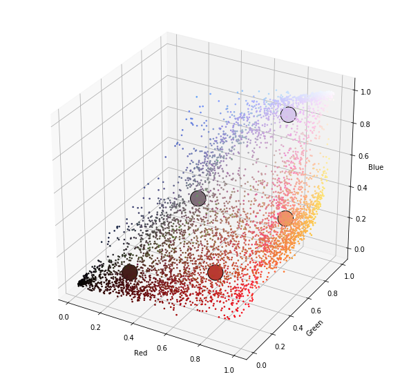
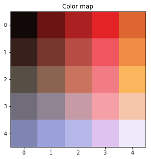
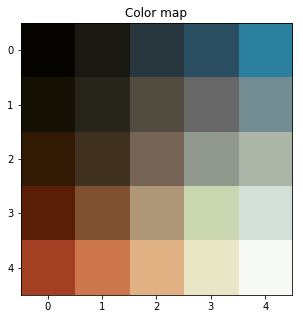

# Color Palette from Image 

It happens often in data engineering that one is making data visualisation diagrams, but picking the colors can be sometimes difficult. I developed this small program to extract color palettes from reference photo. There are two inputs given by the user: 1) url to the photo, and 2) number of colors (n_colors) to be extracted. 

The program uses two different methods to extract colors: 
* K-means clustering to spit the image in RGB color space to the n_colors clusters. The cluster mean points are selected as colors in the palette.  
* Kohonen Self-Organizing Map (SOM). Random selection of original image pixels are given to the SOM algorithm, which then maps them to a n_colors x n_colors two-dimensional palette. 

The SOM method often gives wonderful color palettes and one could pick e.g. any row or column in the square palette matrix. The SOM is trained very small number or iterations (10 in this implementation), which ensures that it produces smooth color gradients, since the algorithm is not given enough time to learn the colors 'too well'. Higher number of training iterations will often give less smooth palette.

This program uses Jupyter notebook as user interface, since it works better for combining images and text. All code is located in two .py files: The som.py file contains the SOM model, which is mostly Sachin Joglekar's code that I ported to Tensorflow 1.6.0 API. Other code is pretty basic Numpy, Pandas, Matplotlib, Sklearn etc. stuff. 

# Examples
The examples below are using the following photo as reference: 

In the diagram below pixel samples are plotted in RGB space. The K-means cluster centers are highlighted with big markers. This example uses 5 color palette. The clustering works in [0, 1] color range and all RGB values have been scaled accordingly. 

The palette obtained from K-means clustering: 

The SOM color palette is shown below. The palette will look different every time the program is run, since the pixel sample is randomized and the SOM initialization varies every time. That could be changed by seeding the random processes always with same value, but I prefer it this way since it is possible to get variations of the same palette theme by running the program multiple times. 

# Another example 

Here is another example, a nice palette example obtained from a photo of Ford Model T.

http://www.swedishbrasscar.com/bilder/95tford7.jpg 

RGB values:

          [5 4 1]     [25 24 17]     [40 55 61]     [42 78 96]  [ 43 128 160]
       [21 16  4]     [39 37 27]     [81 75 64]  [104 103 104]  [115 140 145]
       [49 25  4]     [63 48 31]  [118 100  87]  [145 152 141]  [172 182 168]
       [90 29  5]  [128  81  49]  [175 152 120]  [202 214 176]  [210 224 217]
    [163  63  34]  [206 118  76]  [223 177 131]  [233 231 197]  [247 249 244]

